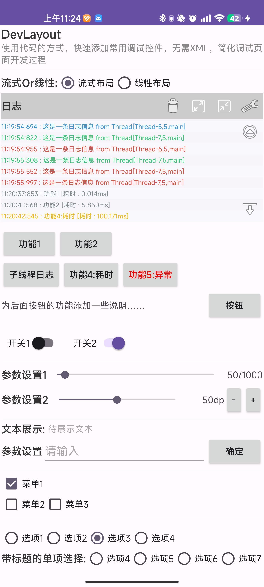
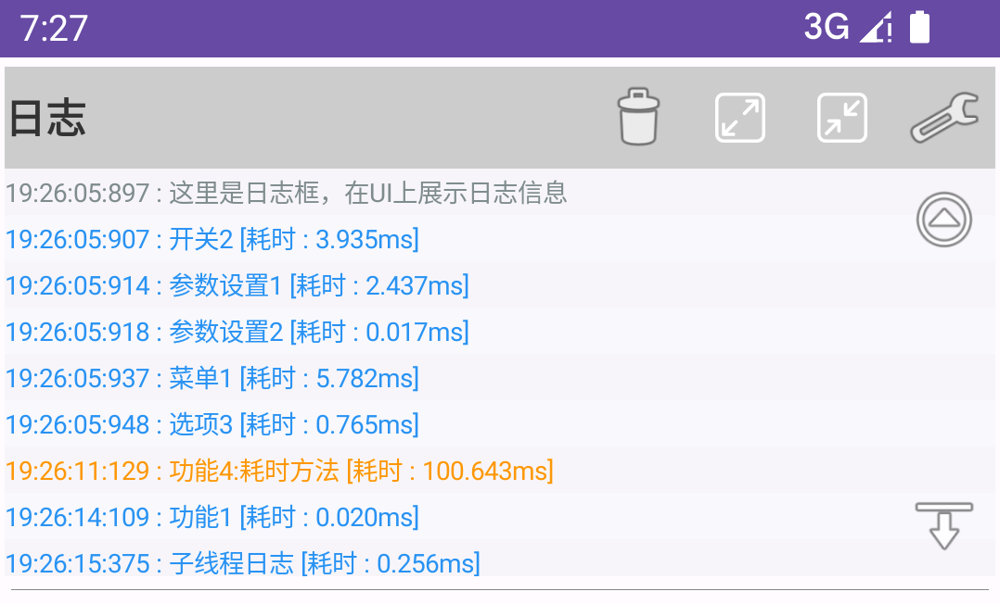

# DevLayout

DevLayout支持使用代码的方式，快速添加常用调试控件，无需XML，简化调试页面开发过程

## 背景

我们在开发组件库的时候，通常会开发一个Demo页面，用于展示或者调试该组件库。  
这种页面对UI的美观度要求很低，注重的是**快速实现**。  
使用XML布局方式开发会比较繁琐，该库会简化这一页面UI的开发流程：

- 对常用的控件进行了封装，可以通过调用DevLayout的方法进行创建；
- 并按流式布局或者线性布局的方式摆放到DevLayout中。



## 引入依赖

在Project的build.gradle在添加以下代码

```groovy
allprojects {
    repositories {
        ...
        maven { url 'https://jitpack.io' }
    }
}
```

在Module的build.gradle在添加以下代码


最新版本：[](https://jitpack.io/#eekidu/devlayout)

```groovy
implementation 'com.github.eekidu:devlayout:Tag'
```

## 使用

DevLayout是一个ViewGroup，你可以把它摆放到页面上合适的位置，然后通过调用它的方法来添加需要子控件。

```Kotlin
//1、创建或者获取一个DevLaout实例
var mDevLayout = findViewById<DevLayout>(R.id.devLayout)


//2、调用方法添加调试控件

/**
 * 添加功能按钮
 */
mDevLayout.addButton("功能1") {
    //点击回调
}

/**
 * 添加开关
 */
mDevLayout.addSwitch("开关1") { buttonView, isChecked ->
    //状态切换回调
}

/**
 * 添加SeekBar
 */
mDevLayout.addSeekBar("参数设置1") { progress ->
    //进度回调
}.setMax(1000).setProgress(50).setEnableStep(true)//启用步进


/**
 * 添加输入框
 */
mDevLayout.addEditor("参数设置") { inputText ->
    textView.text = inputText
}

/**
 * 单选，切换布局样式
 */
mDevLayout.addRadioGroup("布局方式")
	.addItem("流式布局") {
      mDevLayout.setIsLineStyle(false)
	}.addItem("线性布局") {
      mDevLayout.setIsLineStyle(true)
	}.setChecked(0)

/**
 * 添加日志框
 */
mDevLayout.addLogMonitor()

/**
 * 输出日志
 */
mDevLayout.log(msg)
mDevLayout.logI(msg)
mDevLayout.logD(msg)
mDevLayout.logW(msg)
mDevLayout.logE(msg)


/**
 * 添加换行
 */
mDevLayout.br()
/**
 * 添加分割线
 */
mDevLayout.hr()

//其他类型控件见Demo MainActivity.kt

```

## 耗时监控
我们调试代码一个重要的目的就是：发现耗时方法从而进行优化，DevLayout提供一个简易的耗时打印功能，实现如下：
大部分需要调试的代码，会在控件的回调中触发，那么对回调进行代理，在代理中监控原始回调的执行情况，就可以得到调试代码的执行耗时。    

伪代码如下：

~~~kotlin
class ClickProxyListener(val realListener: OnClickListener) : OnClickListener {
  
        override fun onClick(v: View) {
            val startTime = Now()// 1、记录起始时间

            realListener.onClick(v)//原始回调执行

            val eTime = Now() - startTime//2、计算执行耗时
            log("执行耗时：${eTime}")
        }
}

//创建代理对象
val listenerProxy = ClickProxyListener(realListener)
~~~


由于控件种类很多，回调类的类型也都不一样，如何对形形色色的回调统一进行监控？  


动态代理：封装了ProxyListener代理类，对原始回调进行代理

~~~kotlin
open class ProxyListener<T>(val realListener: T) : InvocationHandler {
  
    override fun invoke(proxy: Any, method: Method, args: Array<out Any>?): Any {
        val startTime = Now()// 1、记录起始时间
      
        val result = method.invoke(realListener, *(args ?: emptyArray()))//原始回调执行
      
        val eTime = Now() - startTime//2、计算执行耗时
        log("执行耗时：${eTime}")
        return result
    }
}

//动态创建代理对象
val listener = Proxy.newProxyInstance(_, listenerInterface , ProxyListener(realListener)) 
~~~


结合该例子感受动态代理的优点：

- 灵活性：动态代理允许在运行时创建代理对象，而不需要在编译时指定具体的代理类。这使得代理对象可以根据需要动态地适应不同的接口和实现类。

- 可扩展性：动态代理可以用于实现各种不同的功能，例如日志记录、性能监控、事务管理等。通过在代理对象的方法调用前后插入额外的逻辑，可以轻松地扩展现有的代码功能。

- 解耦合：动态代理可以将代理逻辑与真实对象的实现逻辑分离。这样，代理对象可以独立于真实对象进行修改和维护，而不会影响到真实对象的代码。

- 减少重复代码：通过使用动态代理，可以将一些通用的代码逻辑抽取到代理类中，从而减少代码的重复性。这样可以提高代码的可维护性和可读性。

- 动态性：动态代理可以在运行时动态地创建代理对象，这意味着可以根据需要动态地修改代理对象的行为。这种灵活性使得动态代理在一些特定的场景下非常有用，例如AOP（面向切面编程）。


## 日志

日志是调试代码的重要方式，在某些场景下需要将日志输出到UI上，方便在设备没有连接Logcat，无法通过控制台监测日志时，也能对程序执行的中间过程或执行结果有一定的展示。  

我们可以添加一个日志框到UI界面上，以此来展示Log信息，方式如下：

```kotlin
//添加日志框，默认尺寸，添加后也可以通过UI调整
mDevLayout.addLogMonitor()
mDevLayout.addLogMonitorSmall()
mDevLayout.addLogMonitorLarge()

//输出日志
mDevLayout.log(msg)
mDevLayout.logI(msg)
mDevLayout.logD(msg)
mDevLayout.logW(msg)
mDevLayout.logE(msg)
```



支持过滤：

- 按等级过滤
- 按关键词过滤，多关键字格式：key1,key2

同时，日志信息会在Logcat控制台输出，通过 `tag:DevLayout` 进行过滤查看。

